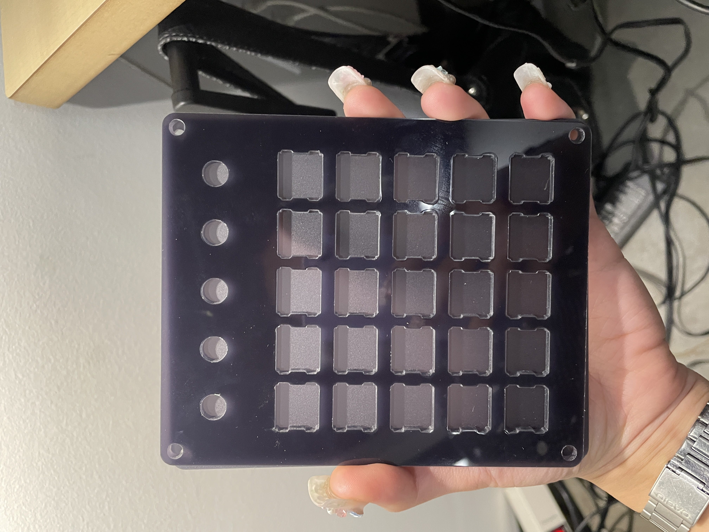
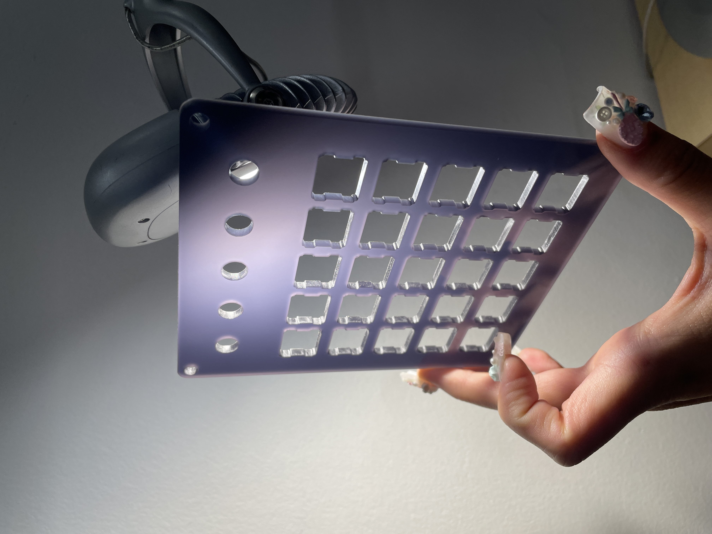
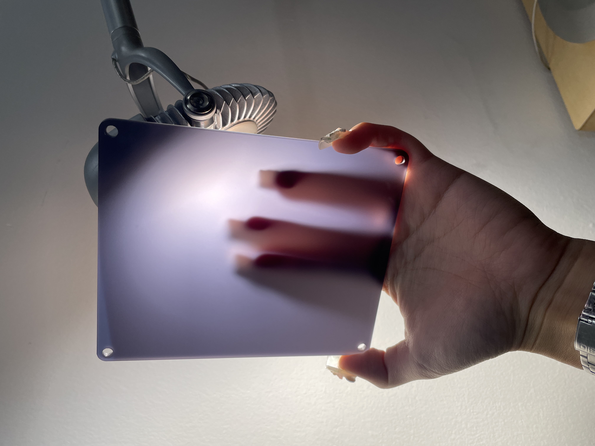
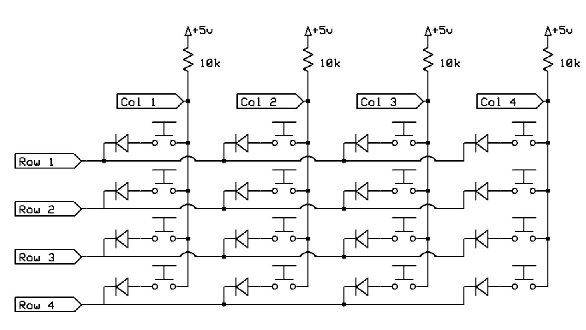
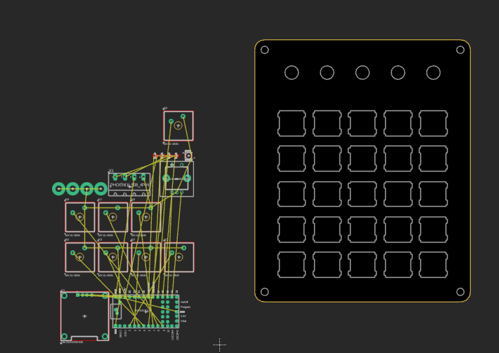

# esp32 + teensy 4.0 + mx-cherry + html powered soundboard synth

*this documentation is scattered & in the planning phase...*
    
# Enclosure Specs

Width: 115.807
Height: 140.807
Rounded corners (5mm)

*.DXF files for laser cutting found in* `/Manufacturing/`

# Components

1. **ESP32-WROVER:** Wifi interface & Input management

    - Spec todo here

2. **Teensy 4.1** Reads UART from ESP32 and updates custom parameters

3. **MX-Cherry Switches**

    - Connected in a matrix (spec todo here)
    
4. **B100K Potentiometers**

4. **Protoboard** 

5. **Input layer (1)**

6. **LED matrix layer(2)**
    - PCB sandwiched here, houses pot's too(?)
        - Two-sided, other side is regulators, connectors, etc.

7. **Component layer(3)**
    - 3D-printed bed for your components to sleep peacefully on:
        - ESP32-WROVER
        - Teensy 4.0
        - logic-level converter (5V -> 3.3V)

# Documentation

# Status

*a pcb sketch of unrouted bits.. little bit stumped now but it is a later problem*

I have to work with the plate's design, which is a bit difficult because the footprint of the `switches` (*the topmost component in the pcb design above*) is not the same of the plate's cutout. 

# TODO!

1. Check if your `MX Switches` have a center LED cutout/pad to accomodate an LED under the switch. Modify the PCB layout.

2. Check if your `MX Switches` have mounting holes for the PCB footprint

3. Check if your `potentiometers` have the same depth as your `MX switches` for PCB mounting

4. Look into `DIODE MATRIX SETUP` for keyboard matrix -> firmware processing

5. Print out your pcb design and compare to plate with mounted switches before manufacturing, maybe even laser cut some cardboard to emulate the pcb design w/ mounting holes for the `MX Switches`

